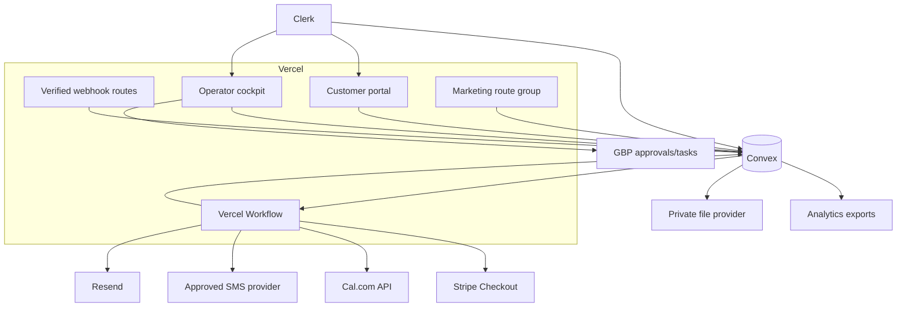

# Sky’s the Limit Painting
## Convex Migration, Premium shadcn Platform Redesign, Authentication Selection, Google Business Profile Audit, and Visitor-to-Paid-Client Operating System

**Audit date:** July 25, 2026  
**Repository:** `skysthelimitpainting1779-collab/skys-the-limit-painting-llc-website`  
**Production branch/commit:** `main` at `c7e94605eefdace7a76ce5145808478df8503dbb`  
**Hosting:** Vercel  
**Change status:** No destructive migration or production code change was performed. This document is the required audit, architecture, validation, and rollback gate before implementation.

## Evidence model and limits

The report distinguishes:

- **Verified repository findings** confirmed in production-branch source.
- **Verified deployment findings** confirmed through connected Vercel data or live HTTP responses.
- **Verified public-business findings** confirmed from the public website/search footprint.
- **Recommendations and assumptions** that require approval or owner-access validation.

Private Google Business Profile metrics, Search Console/GA data, live Supabase row counts, live Payload/Directus content counts, and secret values were not exposed by the available connections. They are not guessed; they are mandatory cutover gates below.

---

# 1. Executive summary

Sky’s the Limit Painting has a real application, not merely a brochure site. It includes a distinctive prep-first marketing position, a Next.js App Router frontend, a lead funnel, project-photo intake, a customer portal, two admin experiences, a CMS, local landing pages, analytics hooks, scheduling, email delivery, CRM forwarding, and Vercel-native deployment.

The current system is nevertheless fragmented:

1. Next.js marketing and landing pages.
2. Supabase Auth, Postgres, public content tables, CRM tables, and storage.
3. Payload CMS on a separate `payload` schema in the same Supabase database.
4. A legacy Directus source still preferred for case studies.
5. A custom `/manage` browser-side Supabase admin.
6. A minimal portal that maps a signed-in email to lead rows.
7. Inline Resend, HubSpot, webhook, ManyChat, Cal.com, and cron integrations.
8. Static fallbacks that mask missing CMS data.

The target should be a single business operating system:

- **Convex:** authoritative operational data, realtime application state, CMS data, authorization, event ledger, file metadata, automation definitions, migrations, and analytics facts.
- **Clerk:** single identity provider.
- **Convex authorization:** the sole business-permission authority.
- **Vercel:** Next.js hosting and durable workflows.
- **shadcn/ui:** source-owned component foundation with a custom brand system.
- **Stripe Checkout Sessions:** hosted deposit collection.
- **Resend:** email.
- **Cal.com:** initial scheduling provider with API/webhook synchronization.
- **Approved SMS provider:** selected only after consent, quiet-hours, opt-out, and webhook requirements are approved.
- **Convex revenue-event ledger:** source of truth for attribution and dashboards.

## Primary authentication decision

**Select Clerk.** Clerk proves identity and manages login/session lifecycle. Convex decides what that identity may read or do.

## Immediate blockers before migration implementation

1. Disable public owner/admin signup on `/manage` and eliminate broad authenticated writes.
2. Repair the `/estimate` submission contract.
3. Replace the rating-filtered Google review path.
4. Repair every advertised service URL returning 404.
5. move customer photos behind private authorization and authoritative validation.
6. Remove or verify hardcoded testimonial claims.
7. Remove PII from referral URLs and browser storage.
8. Snapshot and reconcile every live Supabase, Payload, Directus, and storage object.
9. Complete the owner-access Google Business Profile audit.
10. Prove restore and rollback before write cutover.

---

# 2. Current-state architecture

```mermaid
flowchart LR
    V[Visitor] --> N[Next.js 16 on Vercel]
    N --> M[Marketing/site pages]
    N --> F[Lead and estimate funnels]
    N --> P[Customer portal]
    N --> A[/manage custom admin]
    N --> PA[/admin Payload]

    F --> L[/api/leads]
    L --> S[(Supabase)]
    L --> R[Resend]
    L --> H[HubSpot]
    L --> W[Custom webhook]
    F --> ST[Supabase public storage]

    P --> AU[Supabase Auth]
    P --> S
    A --> AU
    A --> S
    A --> ST

    PA --> PS[Payload schema in Supabase Postgres]
    PA --> S3[S3 media]
    PS --> VW[Views over public CRM tables]

    M --> D[Directus case studies]
    M --> S
    M --> TS[TypeScript/static fallbacks]
```

This is a **three-content-authority, two-admin, two-authentication** system. It cannot safely support the requested visitor-to-paid-client lifecycle without consolidating identity, business state, content publication, events, and workflows.

---

# 3. Repository and deployment audit

## 3.1 Verified stack

The repository uses Node 24, Next.js 16.2.10, React 19.2.7, Payload 3.86.0, Supabase clients, Directus SDK, Tailwind 4.3.1, shadcn 4.13.0, Base UI, Resend, and Vercel analytics. Convex, Clerk, Stripe, Vercel Workflow, and an SMS SDK are absent. `zod` is imported but not declared directly. fileciteturn114file0L3-L92

`next.config.ts` enables Cache Components, wraps the app with Payload, and hardcodes a Supabase storage hostname. fileciteturn70file0L3-L51

`vercel.json` defines security headers, a CSP with inline allowances, redirects, and a daily SEO-ping cron. fileciteturn71file0L3-L59

The deployment smoke test only checks the homepage, estimate, contact, projects, robots, and sitemap. It does not crawl all linked service and location pages or submit a lead. fileciteturn115file0L5-L16

## 3.2 Verified production problems

### Critical: `/manage` is not server-gated

`src/app/manage/page.tsx` is a large client component that logs in directly through Supabase, offers account signup, and executes browser-side CRUD. fileciteturn65file0L183-L313

The route layout only sets `noindex`; it does not authorize access. fileciteturn66file0L3-L14

The Supabase migration grants authenticated users broad writes to settings, testimonials, portfolio, and service areas. fileciteturn45file0L88-L103

**Business impact:** a confirmed non-owner account can potentially modify public content and business settings.

**Required action:** disable signup immediately; server-gate or temporarily remove `/manage`; restrict legacy policies; replace with Clerk staff invitations and Convex authorization.

### Critical: the estimate calculator fails the lead API contract

The calculator submits `source`, `page`, contact fields, project type, prep level, and notes. fileciteturn79file0L198-L225

The lead schema requires `market`, `timeline`, and `contactMethod`. fileciteturn24file0L42-L54

**Business impact:** a visitor can complete a high-intent journey and still fail lead creation.

**Required action:** one shared schema for UI and server; E2E tests for interior, exterior, and cabinet paths; idempotent persistence before delivery.

### Critical: linked service routes return 404

The dynamic route only accepts slugs present in `serviceLandingPages` and invokes `notFound()` otherwise. fileciteturn84file0L9-L23

The footer advertises cabinet refinishing, deck/fence staining, and commercial repaints. fileciteturn107file0L227-L245

Several advertised slugs are absent from the route data and returned live 404 responses. The live 404 also inherited homepage canonical metadata and conflicting robot directives.

**Required action:** create substantive canonical pages or approved redirects; generate navigation, sitemap, and metadata from one route registry; make a full crawler a deployment gate.

### Critical: review gating

The review page sends ratings 4–5 to Google while ratings below 4 enter a private feedback flow. fileciteturn117file0L104-L166

**Required action:** every customer sees the same optional public-review path. Satisfaction/issue resolution remains a separate flow and must not condition Google-link visibility.

### Critical: customer photos are public

The upload endpoint creates a Supabase signed upload URL and then returns a public object URL. fileciteturn27file0L53-L91 Browser-side size validation is bypassable.

**Required action:** private storage; server-side MIME/size/content checks; randomized IDs; file privacy class; scan status; retention; authorized retrieval.

## 3.3 High-severity findings

### PII in browser storage

The lead form places unsent lead payloads in `localStorage`. fileciteturn26file0L44-L50

**Target:** server-created draft plus opaque resume token. No name, email, phone, address, notes, or photo URLs in browser storage.

### PII in referral URLs

The referral page creates `?ref=<email>` links. fileciteturn119file0L16-L35 The header saves that value locally. fileciteturn116file0L54-L62

**Target:** opaque, signed, revocable referral codes linked server-side.

### Email-string portal ownership

Portal queries and RLS associate resources with the signed-in email. fileciteturn33file0L38-L90

**Target:** identity → user → contact → explicit company/property/project grants. Never infer ownership only from email text.

### Non-durable external effects

`/api/leads` writes Supabase and performs Resend, auto-reply, webhook, and HubSpot calls inline. fileciteturn22file0L21-L118 There is no idempotency key, durable retry, reconciliation queue, or operator replay.

**Target:** atomic lead/domain-event mutation, outbox, durable workflow, provider idempotency, webhook receipts, visible failure history.

### Process-local rate limiting

The rate limiter is a `Map` in application memory. fileciteturn24file0L110-L129

**Target:** distributed edge/provider protection and durable rate state.

### ManyChat lead-loss risk

The ManyChat handler performs provider delivery without first persisting the canonical lead and conflicts with its own phone-or-email requirement. fileciteturn74file0L215-L305

**Target:** all intake sources call one canonical `createLead` mutation.

### Payload secret fallback

Payload falls back to `CHANGE_ME_IN_ENV`. fileciteturn13file0L88-L96

**Target:** production startup fails safely if the secret is absent.

### Payload administrator privilege

Any authenticated Payload admin can manage other admins, while the role field is not enforced. fileciteturn34file0L18-L42

**Target:** owner-only user administration; audited staff lifecycle.

### Multiple content authorities

The projects page resolves Directus → Supabase → static fallback. fileciteturn54file0L97-L191 Payload also defines portfolio content.

**Target:** export, deduplicate, freeze, and make Convex the sole publication authority.

### Unverified fallback testimonials

The review carousel contains hardcoded named testimonials and silently displays them when Supabase data is absent. fileciteturn118file0L20-L53 fileciteturn118file0L55-L101

**Target:** every displayed review has source, date, permission/provenance, and external ID where applicable.

### Analytics cannot prove revenue

The analytics helper only sends selected browser events and reads UTM values from the current URL. fileciteturn75file0L13-L40

**Target:** server event ledger and revenue facts in Convex; persistent first-touch, last-non-direct, and full-touch attribution; no raw PII in analytics.

## 3.4 Medium findings

- Marketing shell wraps internal portal/admin surfaces.
- SEO landing composition is entirely client-rendered with motion. fileciteturn85file0L3-L55
- Global CSS forces square corners on every element and contains competing token systems. fileciteturn60file0L124-L178
- Header and footer expose different public email addresses.
- App sitemap and postbuild sitemap generator overlap. fileciteturn81file0L25-L52
- Robots rules omit `/manage` and `/portal` even though `/manage` has route metadata. fileciteturn82file0L12-L48
- CSP retains global inline allowances and legacy provider hosts.
- Current year is hardcoded.
- Environment example is incomplete for actual production integrations. fileciteturn99file0L12-L38

---

# 4. Supabase inventory and source-to-target design

## Verified objects

- `auth.users`
- out-of-band `public.profiles`
- `public.leads`
- `public.lead_events`
- `public.settings`
- `public.testimonials`
- `public.portfolio`
- `public.service_areas`
- referenced `public.crm_tasks`
- referenced `public.jobs`
- referenced `public.job_photos`
- `lead-photos` storage
- `cms-assets` storage
- RLS policies
- Payload bridge views

The lead and event tables are versioned. fileciteturn29file0L3-L48 The portal RLS policy grants lead reads by matching email. fileciteturn32file0L10-L22 Several hardening migrations reference database objects that were provisioned outside the repository. fileciteturn46file0L3-L36

## Migration mapping

| Source | Convex target | Transformation | Priority | Validation | Rollback |
|---|---|---|---|---|---|
| `auth.users` | Clerk identities + `users` | preserve legacy ID; invite/link active users; do not assume password portability | P0 | user count/link report + active-login test | retain Supabase Auth |
| `profiles` | `users`, `roleBindings` | inspect live roles; map explicit scopes | P0 | user/role comparison | policy snapshot + emergency owner path |
| `leads` | `leads`, `contacts`, `properties`, `opportunities`, `attributionTouches` | normalize/split/dedupe; preserve `lead_id` | P0 | counts/checksums/semantic samples | dual write + legacy read |
| `lead_events` | `domainEvents`, `automationRuns`, `automationSteps` | attach correlation/provider status | P0 | per-lead event reconciliation | immutable export |
| `settings` | `siteSettings`, `seoDocuments` | resolve Supabase/Payload/code conflicts | P1 | crawl/settings diff | legacy adapter |
| `testimonials` | `reviews`, `reviewSources` | verify source, permission, date, external ID | P0 | 100% provenance gate | unpublished archive |
| `portfolio` | `caseStudies`, `galleries`, `mediaAssets` | deduplicate Directus/Payload/static records | P1 | asset hashes + route/visual diff | static/legacy fallback |
| `service_areas` | `serviceAreas`, `contentEntries`, `contentRoutes` | merge local facts and canonical slugs | P1 | local-value and route review | route adapter |
| `crm_tasks` | `tasks` | inspect live schema first | P0 | object/count report | raw export |
| `jobs` | `projects` | inspect live relationship/data | P0 | object/relationship report | raw export |
| `job_photos` | `files`, `fileLinks` | checksum, scan, classify, attach | P0 | manifest/access tests | private archive |
| `lead-photos` | private files | re-upload with privacy/access metadata | P0 | byte hashes + denied anonymous access | private legacy bucket |
| `cms-assets` | `mediaAssets`, files | hash/deduplicate; migrate alt/caption/tags | P1 | manifest/visual diff | CDN redirect/proxy |
| RLS | Convex `authorize()` | action/resource matrix, deny by default | P0 | complete authorization suite | retain policies |
| triggers/functions | internal functions/domain events | export and classify live definitions | P0 | definition checksums | SQL archive |

Do not reproduce the relational schema blindly. Model access patterns, authorization boundaries, realtime queues, publication state, and workflow state.

---

# 5. Payload and Directus audit

Payload registers Admins, Services, Service Areas, Portfolio, Testimonials, FAQs, Media, Leads, CRM Tasks, and Site Settings. It uses a Supabase Postgres connection, separate schema, migrations, Lexical, S3 media, live preview, and GraphQL. fileciteturn13file0L24-L97

## Payload target mapping

- Admins → Clerk staff + Convex role bindings.
- Services → content entries/revisions/routes/SEO.
- Service Areas → service areas + substantive local content.
- Portfolio → case studies/galleries/media.
- Testimonials → verified reviews.
- FAQs → structured content blocks.
- Media → private/public file abstraction and media metadata.
- Leads/CRM tasks → native CRM domains.
- Site Settings → versioned site settings.
- Drafts/versions → `contentRevisions`.
- Preview → signed expiring preview, noindex.
- Scheduled publication → Convex schedule or durable workflow.
- Redirects → one tested route registry.

Directus defines case studies, markets, and site config. fileciteturn50file0L3-L68 Export all records and assets even where current helpers appear unused, then deduplicate against Payload, Supabase, and static data.

## Replacement editor

The Convex editor should be task-oriented:

- Add project.
- Publish service page.
- Edit service area.
- Add verified review.
- Add/update photo with privacy, consent, service, project, location, alt, and before/after metadata.
- Draft → review → scheduled → published → archived.
- Revision diff and rollback.
- Phone/tablet/desktop preview.
- Broken-link, missing-metadata, and stale-content warnings.
- Approval-gated GBP post/photo tasks.

---

# 6. Authentication Architecture Decision Record

## Decision

**Clerk is the primary identity provider. Convex is the authorization authority.**

## Candidate assessment

| Candidate | Score | Decision | Main reason |
|---|---:|---|---|
| Clerk | 88/100 | Selected | Best direct Convex/Next.js production fit with managed customer/staff identity lifecycle |
| Better Auth | 80/100 | Runner-up | Strong control and Convex integration; greater operational/security ownership |
| WorkOS AuthKit | 78/100 | Future B2B option | Excellent enterprise identity; more than the company needs now and less direct Convex fit |
| Auth.js | 60/100 | Rejected | Requires assembling invitations, MFA, administration, organizations, and recovery |
| Convex Auth | 58/100 | Rejected for current release | Attractive consolidation, but maturity/server-integration risk is too high for payments and customer data |

## Session and authorization model

1. Clerk authenticates the person.
2. Convex validates the identity token.
3. `users.authSubject` stores the stable subject.
4. `requireUser()` rejects missing/disabled users.
5. `authorize(user, action, resource)` evaluates role bindings and grants.
6. Protected functions return minimal DTOs.
7. Frontend role checks are cosmetic only.
8. Privileged actions require reason and create immutable audit events.

## Role model

Role templates:

- visitor
- lead
- residential customer
- commercial customer
- property manager
- crew member
- subcontractor
- estimator
- sales representative
- project manager
- content editor
- marketing manager
- administrator
- owner
- automated system actor

A `roleBinding` contains user, role, scope type, scope ID, start/end, status, grantor, and reason. Scope can be global, company, property, or project.

## Invitations, MFA, deprovisioning

- Customers receive an invitation only after being linked to a contact/property/opportunity or through a verified proposal access flow.
- Staff are invitation-only.
- MFA is mandatory for owner, admin, payment/refund approvers, permission managers, and support impersonation.
- Deprovisioning marks the Convex user disabled and revokes grants immediately through verified lifecycle events.
- Never merge accounts solely because emails match.
- Supabase Auth remains available during the rollback window.

## Support impersonation

Disabled in the first release. Later use must be owner-only, reason-required, short-lived, read-only by default, visibly bannered, fully audited, and prohibited from signatures, payments, refunds, permissions, and project completion.
---

# 7. Proposed Convex schema

The schema is organized around business access patterns rather than copied SQL tables.

## 7.1 Identity and access

### `users`
Fields:
- `authSubject`
- canonical email
- E.164 phone
- display name
- user type
- status
- last seen
- legacy identity IDs
- created/updated timestamps

Indexes:
- `by_authSubject`
- `by_emailCanonical`
- `by_status`

### `roles`
Role templates and system metadata.

### `permissions`
Atomic permissions such as:
- `lead.read.assigned`
- `lead.assign`
- `property.read`
- `estimate.create`
- `estimate.approve`
- `proposal.publish`
- `agreement.send`
- `payment.request`
- `refund.approve`
- `project.update`
- `content.publish`
- `gbp.approve`
- `automation.enable`
- `role.grant`
- `support.impersonate`

### `rolePermissions`
Role-to-permission relationships.

### `roleBindings`
User, role, scope type, scope ID, effective dates, status, grantor, reason.

Indexes:
- `by_user`
- `by_scope`
- `by_user_scope`
- `by_status_expiresAt`

### `resourceGrants`
Explicit exceptions for one company, property, project, proposal, or file.

### `supportSessions`
Expiring, audited, initially disabled.

## 7.2 CRM and revenue

### `contacts`
A person independent of login. Includes normalized communication channels, dedupe key, consent references, and lifecycle state.

### `companies`
Commercial customers, property-management companies, municipalities, vendors, and subcontractors.

### `properties`
Service address, customer-facing label, property type, service-area classification, occupancy/access notes, and privacy flags.

### `contactProperties` and `companyContacts`
Explicit relationships.

### `leadIntakeSessions`
Anonymous or identified draft state, attribution snapshot, last completed step, status, and expiry.

### `leads`
Canonical inquiry:
- source
- service family
- market
- territory result
- urgency
- qualification state
- score
- assignee
- SLA deadline
- intake session
- duplicate-review state

Indexes:
- `by_status_createdAt`
- `by_assignedTo_status`
- `by_slaDeadline`
- `by_normalizedEmail`
- `by_normalizedPhone`
- `by_intakeSessionId`

### `duplicateCandidates`
Stores candidate matches and human resolution. Never silently merges conflicting customers or properties.

### `pipelines` and `pipelineStages`
Separate residential, commercial/property management, and municipal/public-sector processes.

### `opportunities`
Contact/company/property, pipeline/stage, expected value, probability, owner, next action, and loss reason.

Indexes:
- `by_pipeline_stage_updatedAt`
- `by_owner_stage`
- `by_property`
- `by_contact`
- `by_company`

### `opportunityStageHistory`
Immutable transitions with actor, timestamp, source, and reason.

### `tasks`, `activities`, `notes`, `tags`, `entityTags`
One customer/opportunity/project timeline without forcing every event into an unindexed generic document.

## 7.3 Scheduling, estimating, proposals, agreements, and payments

### `appointments`
Provider ID, property, opportunity, estimator, start/end, status, attendance, source, and reschedule history.

Indexes:
- `by_startAt`
- `by_assignee_startAt`
- `by_opportunity`
- `by_providerEventId`

### `estimates`
Current estimate state and approved version.

### `estimateVersions`
Inputs, assumptions, rule version, price range, approval, created by, and immutable publication state.

### `estimateLineItems`
Typed units, quantities, unit price, minimums, modifiers, exclusions, and display order.

### `proposals`
Opportunity, current published version, status, expiration, viewed/accepted timestamps.

### `proposalVersions`
Immutable customer-facing scope, options, exclusions, schedule assumptions, warranty, and payment terms.

### `proposalItems`
Line items and alternates.

### `proposalViews`
Consent-aware view telemetry.

### `agreements`
Exact proposal/agreement version, signers, status, signed artifact, and provider references.

### `signatureEvents`
Immutable signature evidence.

### `paymentRequests`
Deposit/invoice request, amount, due date, provider session ID, status.

### `payments`
Provider payment ID, amount, status, paid time, reconciliation state.

### `paymentEvents`
Provider event ID, type, sequence, raw-body retention reference, processing state.

### `refunds`
Request, approval, reason, amount, provider result.

Critical indexes:
- proposal by opportunity/status
- agreement by proposal/status
- payment request by opportunity/status/due date
- payment event by provider/event ID
- refund by approval status

## 7.4 Project delivery

- `projects`
- `projectPhases`
- `projectAssignments`
- `crewProfiles`
- `changeOrders`
- `projectUpdates`
- `completionChecks`
- `warranties`

Every project update declares visibility:
- internal
- customer
- crew
- shared

## 7.5 Communications and files

- `conversations`
- `messages`
- `communicationConsents`
- `notifications`
- `files`
- `fileLinks`
- `mediaAssets`
- `galleries`
- `galleryItems`

A file stores:
- provider object key
- hash
- MIME type
- byte size
- scan state
- privacy class
- uploader/owner
- linked business resource
- retention/delete dates
- derivative metadata

Knowing a storage ID never grants access.

## 7.6 CMS, SEO, reviews, referrals, and GBP

- `contentEntries`
- `contentRevisions`
- `contentRoutes`
- `redirects`
- `seoDocuments`
- `serviceAreas`
- `reviews`
- `reviewSources`
- `reviewRequests`
- `reviewResponses`
- `referrals`
- `gbpTasks`
- `gbpPostDrafts`
- `gbpReviewQueue`
- `gbpObservations`
- `competitorSnapshots`

Indexes:
- content route by path/status
- content by type/status/updated time
- review queue by response status/created time
- referral by code/status
- GBP task by status/due date

## 7.7 Automation, integrations, audit, analytics, and migration

- `domainEvents`
- `outboxEvents`
- `webhookReceipts`
- `idempotencyKeys`
- `automationDefinitions`
- `automationVersions`
- `automationRuns`
- `automationSteps`
- `automationApprovals`
- `integrationConnections`
- `integrationHealth`
- `auditLogs`
- `systemAlerts`
- `analyticsEvents`
- `conversionFacts`
- `attributionSnapshots`
- `migrationRuns`
- `legacyMappings`
- `reconciliationResults`

Critical indexes:
- webhook receipt by provider/event ID
- outbox by status/next attempt
- automation run by status/next attempt
- audit by actor/time and entity/time
- analytics by session/time
- conversion facts by opportunity/event type
- reconciliation by migration run/status

## Convex engineering rules

- Validators on every public/internal function argument and stored document.
- Staged indexes before large production backfills.
- No unbounded collection scans.
- Internal functions for server-only operations.
- Small deterministic mutations.
- Mutations write state and domain event atomically.
- External calls occur in actions/workflows, never as the only record of intent.
- Minimal DTOs.
- Legacy source/ID/checksum on imported documents.
- Explicit retention and redaction.

---

# 8. Proposed application architecture



## Route groups

- `src/app/(marketing)` — public pages, local pages, case studies, estimate.
- `src/app/(portal)` — customer experience.
- `src/app/(app)` — staff/operator system.
- `src/app/api/webhooks` — signature-verified external callbacks.
- `src/app/api/public` — narrow anonymous boundaries where Convex HTTP functions are not preferable.

The current universal marketing layout is split. Portal/app routes do not inherit LocalBusiness schema, public footer, sticky estimate CTA, or heavy marketing navigation.

## Server/client strategy

- Public content and metadata are Server Components.
- Estimate stepper, file upload, scheduling, before/after, and realtime operational controls are focused client islands.
- Route existence, metadata, canonical, sitemap, navigation, and redirects derive from one published route registry.
- Authenticated server fetches carry the Clerk/Convex token.
- Browser code never receives a service role or unrestricted database client.

---

# 9. Premium shadcn/ui design system

## Brand direction: Measured Craft

Preserve:
- prep-first discipline
- owner accountability
- project documentation
- commercial/public-sector readiness

Change:
- reduce all-black density
- stop applying uppercase and square geometry everywhere
- introduce warm residential trust
- give internal tools calm, light operational surfaces
- make real photography and project proof dominant

## Semantic tokens

- `--background`
- `--foreground`
- `--surface-1`
- `--surface-2`
- `--surface-3`
- `--primary`
- `--primary-foreground`
- `--accent`
- `--accent-foreground`
- `--muted`
- `--muted-foreground`
- `--border`
- `--focus-ring`
- `--success`
- `--warning`
- `--danger`
- `--info`

Direction:
- warm mineral/off-white public base
- deep ink or navy-charcoal
- oxide/clay conversion accent
- restrained status colors
- dark surfaces used selectively for proof, proposals, or premium emphasis

## Typography

- restrained editorial display face for selected public headlines
- highly legible sans for body/forms/admin/portal
- tabular mono only for dimensions, IDs, and operational timestamps
- public/portal body minimum 16px
- 55–72 character body measure
- no long all-uppercase paragraphs or controls

## Spacing, geometry, shadow, motion

- spacing: 4, 8, 12, 16, 24, 32, 48, 64, 96
- radii: 8, 12, 16, 24
- square geometry only for intentional measurement motifs
- restrained two-level shadow hierarchy
- 120ms immediate, 180ms standard, 280ms emphasized motion
- no fake chat delays, page-wide blur reveals, or decorative motion that obscures work
- reduced motion always honored

## Core source-owned shadcn components

Foundation:
- button
- input
- textarea
- select
- combobox
- checkbox
- radio group
- switch
- form field
- calendar/date-time picker
- popover
- tooltip
- dialog/alert dialog
- drawer/sheet
- dropdown menu
- command
- tabs
- accordion
- data table
- pagination
- toast
- skeleton
- progress
- avatar
- badge
- breadcrumb
- sidebar
- chart wrappers

Business components:
- estimate step
- service selector
- property selector
- territory result
- project photo uploader
- lead quality summary
- lead card
- pipeline board
- opportunity drawer
- customer timeline
- proposal builder/viewer
- scope option
- agreement panel
- deposit checkout card
- project status timeline
- before/after comparison
- review evidence card
- appointment scheduler
- workflow builder/run history
- approval queue
- command center
- revenue dashboard
- SEO editor
- route health panel
- GBP workspace
- integration health card

Do not ship stock shadcn appearance. Keep component business logic outside presentation primitives.

## Example composition: service page

1. service/local intent hero
2. primary estimate/call action
3. owner/insurance/registration/response proof
4. relevant project/case study
5. what affects scope and price
6. preparation/process proof
7. verified reviews
8. service-area fit
9. adaptive estimate entry
10. FAQ and relevant links

## Example composition: mobile estimate

- one decision per viewport
- visible progress
- autosave
- thumb-reachable back/continue
- contact after value
- clear planning-range disclaimer
- direct schedule handoff
- no forced long notes before contact
- accessible errors and status announcements

## Example composition: command center

- SLA queue
- today’s estimates/tasks
- proposal/deposit blockers
- revenue pipeline
- delayed projects
- failed workflow/webhook queue
- SEO/GBP tasks
- command palette
- mobile call/text/note/status actions

## Accessibility

Target WCAG 2.2 AA:

- keyboard-complete operation
- visible, unobscured focus
- practical target sizes
- labeled fields and descriptions
- error summary plus inline errors
- status announcements
- no color-only state
- contrast validation
- redundant-entry reduction
- accessible authentication/recovery
- reduced motion
- axe automation plus manual keyboard/screen-reader acceptance

---

# 10. Public website redesign

## Navigation

- Services
- Projects
- Service Areas
- Commercial & Property Management
- About
- Resources
- Request Estimate
- Call/Text

Public-sector capability remains visible but should not make homeowners feel excluded.

## Required pages and conversion goals

### Homepage
Goal: establish fit, proof, and next action.

### Service pages
Interior, exterior, cabinet refinishing, deck staining, fence staining, commercial repainting, multifamily, light-pole/municipal/public-sector. Each receives original proof, process, FAQs, schema, local links, and a conversion path.

### Audience pages
Residential, commercial, property management, multifamily, municipal/public sector.

### Service-area pages
Only where the company has real coverage and substantive local value. No city-name replacement pages.

### Projects/case studies
Each project stores:
- service
- general location
- property type
- initial condition
- preparation
- products/system where appropriate
- duration
- before/after
- result
- permission
- related service/location

### Reviews
Only verified sources and consented testimonials.

### Commercial bid request
Company, sites, deadline, documents, insurance/compliance requirements, walkthrough dates, and clarification questions.

## Page contract

Every indexable page declares:
- search intent
- visitor segment
- primary/secondary conversion
- required proof
- canonical route
- schema type
- internal-link parents/children
- analytics events
- publication owner
- review date

---

# 11. Visitor-to-Paid-Client Blueprint

| Stage | Canonical state | Immediate next action | Automation | Primary KPI |
|---|---|---|---|---|
| Visitor | session + attribution | relevant service/location proof | persist first touch with consent | revenue/visitor |
| Engaged | service/case study/calculator/call event | low-friction scope choice | abandonment only after identification | engaged-to-lead |
| Identified lead | lead + contact/property draft | confirm and offer schedule | normalize, dedupe, assign, alert | qualified lead conversion |
| Qualified opportunity | opportunity | book estimate or request evidence | territory/value/urgency routing | lead-to-estimate |
| Estimate booked | appointment | preparation instructions | confirmations/reminders/reschedule | booking/show rate |
| Estimate completed | estimate | prepare proposal | SLA/task/missing-data checks | estimate-to-proposal |
| Proposal delivered | immutable proposal version | review/questions | view alert + timed follow-up | proposal acceptance |
| Accepted | acceptance event | agreement | signature workflow | acceptance-to-signature |
| Signed | agreement evidence | deposit | hosted checkout | signature-to-deposit |
| Deposit paid | payment fact | project handoff/schedule | onboarding/crew/material tasks | deposit completion |
| Scheduled/in progress | project | milestone communication | start/change-order/status workflows | cycle time/margin |
| Completed | completion checklist | satisfaction | closeout/warranty | completion quality |
| Satisfaction | feedback | universal review invitation | review reminders/issues escalation | review rate |
| Advocate/repeat | referral/repeat opportunity | referral/next service | opaque attribution/reactivation | referral/repeat rate |

## Initial SLAs

- confirmation: under 1 minute
- staff alert: under 1 minute
- human response target: 5–15 minutes during business hours
- uncontacted escalation: 30 and 120 minutes
- estimate reminders: 24 hours and 2 hours
- no-show follow-up: within 15 minutes
- proposal preparation: same/next business day by scope
- proposal follow-up: 1, 3, and 7 days
- deposit reminder: 24 and 72 hours
- review request: 24–48 hours after completion/satisfaction, without rating gating

---

# 12. CRM specification

## Canonical entities

Leads, contacts, companies, properties, opportunities, tasks, activities, appointments, estimates, proposals, agreements, payment requests, payments, projects, reviews, referrals, campaigns, and sources.

## Pipeline families

### Residential
New → Attempting contact → Contacted → Qualified → Estimate requested → Scheduled → Completed → Proposal preparing → Sent → Viewed → Questions → Agreement pending → Signed → Deposit pending → Paid → Project scheduled → Won/Lost/Nurture.

### Commercial/property management
New → Qualification → Sites/documents received → Walkthrough → Scope clarification → Estimating → Bid submitted → Clarification/negotiation → Award pending → Agreement/PO → Deposit/mobilization → Scheduled → Won/Lost/Nurture.

### Municipal/public sector
Opportunity identified → Bid/no-bid → Documents reviewed → Site visit/RFI → Estimate → Approval → Submitted → Addenda → Apparent award → Compliance/contracting → Mobilization → Won/Lost.

## Lead scoring

Deterministic first:
- territory
- service fit
- value band
- timeline
- decision-maker status
- evidence supplied
- property count
- repeat/referral source
- response behavior

AI may summarize and suggest. It does not price or override policy.

## Duplicate policy

Normalize phone, email, address, and provider IDs. Fuzzy candidates require review. Never auto-merge conflicting properties or owners.

## Unified activity timeline

- intake
- call/text/email
- notes/tasks
- stage changes
- appointments
- estimate/proposal versions
- views/questions
- signatures/payments
- project updates
- review/referral
- automation/failure events

---

# 13. Estimate and proposal specification

## Adaptive estimate flow

Branches:
- residential/commercial/municipal/property manager
- service
- property type
- location/territory
- size/stories/rooms
- condition/preparation
- timeline
- budget comfort
- decision maker
- photos/documents
- contact preference
- availability

Required mechanics:
- server-created draft
- autosave by opaque token
- resume link
- attribution snapshot
- duplicate detection
- shared validation
- step/abandonment analytics
- immediate confirmation
- schedule handoff
- planning-range vs firm-proposal distinction

## Pricing governance

Replace hardcoded formulas with versioned rules or a controlled pricebook:

- rule version/effective dates
- unit assumptions
- minimums
- preparation/access modifiers
- product allowance
- exclusions
- manual override reason
- human approver
- audit history

AI cannot determine final price.

## Proposal builder/viewer

Builder:
- templates by market/service
- scope and line items
- alternatives/upgrades
- assumptions/exclusions
- preparation and product system
- schedule/window
- warranty
- expiration
- tax/payment terms
- attachments
- internal approval
- immutable published version

Viewer:
- mobile-first summary
- option comparison
- customer questions
- consent-aware view events
- acceptance
- agreement/signature
- hosted deposit
- printable/downloadable artifact
- accessible errors and status

---

# 14. Customer portal

Customers can:
- sign in securely
- access only granted companies/properties/projects
- view/reschedule appointments
- review estimates/proposals
- ask questions
- approve proposals
- sign agreements
- pay deposits/invoices
- view schedules/milestones
- upload/download files
- approve change orders
- download receipts/warranties
- submit feedback
- leave a review
- refer a customer
- request more work

Information hierarchy:
1. next action
2. current status
3. upcoming date
4. messages/questions
5. documents/payments
6. history

The portal should not resemble a CRM.

---

# 15. Operator cockpit

Primary queues:
- new/uncontacted/SLA-risk leads
- follow-ups due
- estimates awaiting schedule
- today/upcoming/no-show estimates
- proposals to prepare/customer action
- agreements/deposits pending
- projects starting/delayed
- unpaid invoices
- review/referral tasks
- failed workflows/webhooks
- integration health
- SEO/GBP approval tasks

Mobile operator mode:
- call/text
- add note
- change stage
- create task
- upload photo
- mark estimate arrival/completion
- send approved template
- view property directions

Revenue dashboard:
- pipeline and weighted value
- won/completed revenue
- stage conversion/time
- response SLA
- average project value
- lost reasons
- source/service/location performance
- review/referral/repeat

---

# 16. Automation Center

An automation stores:
- trigger
- version
- conditions/branches
- delays
- actions
- approval gates
- retry/timeout/failure policy
- escalation
- test/enabled state
- metrics
- creator/approver
- change history

Each run stores:
- definition/version
- trigger event
- idempotency key
- current state
- step history
- provider references
- attempt/retry
- approval state
- failure category
- replay history
- result

Controls:
- enable/disable
- clone/version
- dry run
- fixture test
- effect preview
- execution search
- error inspection
- safe replay
- cancel where supported
- approval inbox
- metrics
- immutable audit

AI is limited to summarization, drafting, classification, and suggestions. It cannot autonomously decide pricing, deposits, payment totals, legal terms, identity, permissions, refunds, completion, or financial reporting.

---

# 17. Vercel Workflow and Convex scheduling

## Convex scheduled functions

Use for:
- simple at-time reminders
- atomic state + scheduled follow-up
- internal reconciliation
- stale sweeps
- token/grant expiry
- content publishing
- deterministic internal jobs

## Vercel Workflow

Use for:
- multi-day lead/proposal/deposit sequences
- email/SMS/calendar/payment effects
- human approval waits
- branches across provider responses
- retryable external operations
- project onboarding/milestones
- review/referral campaigns
- migration orchestration

## Side-effect contract

Every provider action records:
- internal command ID
- provider idempotency key
- provider event/message ID
- request hash
- intended recipient/resource
- state
- attempt count
- next retry
- last error
- permanent-failure reason
- replay metadata

## Webhook contract

1. Read raw body.
2. Verify signature/timestamp.
3. reject invalid replay.
4. insert receipt keyed by provider/event ID.
5. return success for processed duplicates.
6. transition state through an internal mutation.
7. reconcile out-of-order events.
8. alert on permanent failure.
---

# 18. Google Business Profile audit

## Verified public-business findings

- The public business identity is Sky’s the Limit Painting LLC, positioned around Inver Grove Heights and the Twin Cities.
- The public phone appears as 651-410-4196.
- The website exposes inconsistent email addresses between header and footer.
- The repository hardcodes a Google Maps CID and more than one Google review-link format.
- Service-area and LocalBusiness structured data exist.
- Advertised service landing pages return 404.
- Hardcoded fallback reviews lack stored provenance.
- An obsolete Vercel-hosted site variant has appeared in public search, creating canonical/entity fragmentation risk.

## Owner-access required

The following remain explicitly unverified until the connected owner account is inspected:

- ownership and verification
- current primary and secondary categories
- address visibility and service-area configuration
- current phone/site/appointment links
- regular and holiday hours
- opening date and attributes
- service/product inventory
- current rating, review count, velocity, recency, and themes
- unanswered reviews and response speed
- photo/video inventory and performance
- posts/offers/events
- Q&A
- profile performance/conversions
- suggested edits
- duplicate listings
- suspension warnings
- local-rank grid

## Provisional primary-category decision

Use the most specific truthful category available in the owner interface, expected to be **Painter**. Add only categories representing real services. Never add categories solely for keyword coverage.

## Address and service-area policy

Before publishing a physical address in GBP or structured data, verify whether customers can visit a staffed and permanently signed location during published hours. If not, configure a service-area business and hide the address. Maintain one legitimate profile, not city-specific duplicates.

## Immediate GBP/local risks

1. Review gating.
2. Contact inconsistency.
3. Broken service landing pages.
4. Unverified review proof.
5. Stale/multiple review and appointment link formats.
6. Duplicate indexed Vercel hostname.
7. Structured address claims requiring owner verification.
8. Private performance data unavailable to the current operating process.

---

# 19. Google Business Profile roadmap

## First 14 days

- Confirm owner access and profile verification.
- Export details, users, reviews, photos, posts, services, Q&A, and performance.
- Establish one canonical name, phone, email, website, and business model.
- Confirm primary category and remove irrelevant categories.
- Verify address visibility and service areas.
- Repair website/appointment links with UTM tracking.
- Remove review gating.
- Respond to unanswered legitimate reviews with human approval.
- Inventory duplicate/stale listings.
- Upload verified logo, cover, team, vehicle, and real project photos.

Suggested tracking:
- website: `utm_source=google&utm_medium=organic&utm_campaign=gbp&utm_content=website`
- appointment: same source/medium/campaign with `utm_content=appointment`

## 30–60 days

- Complete service inventory aligned to canonical pages.
- Publish a balanced real-photo set: preparation, before/after, team, vehicle, interior, exterior, commercial, municipal capability.
- Create weekly approved post drafts tied to projects, seasonal education, and service pages.
- Build a universal post-completion review workflow.
- Draft Q&A from real customer questions.
- Align services, landing pages, and conversion paths.
- Monitor edits, duplicates, and suspension risks.

## Ongoing cadence

- Weekly: reviews, questions, hours, links, new project photos.
- Biweekly: approved post.
- Monthly: categories, services, competitor observations, landing alignment.
- Quarterly: NAP/citation audit, profile users, policy review, photo mix, conversion attribution.

## GBP workspace in the operator cockpit

- ownership/verification checklist
- review queue
- suggested response drafts
- post drafts and approval
- photo reminders/checklist
- Q&A alerts
- hours/holiday-hours review
- category/service review
- UTM link registry
- local-rank notes
- competitor observations
- policy/suspension checklist

Direct publishing remains approval-gated unless a secure official integration is implemented and tested.

---

# 20. SEO and local-search roadmap

## P0 technical repair

- Repair every linked 404.
- Ensure 404s are noindex and do not claim the homepage canonical.
- consolidate sitemap generation.
- Include only canonical indexable 200 URLs.
- Add route crawling to deployment verification.
- remove/protect obsolete deployment hostnames.
- Normalize public name, phone, email, and service-area facts.
- Remove or verify unsupported reviews.
- Validate every canonical, redirect, metadata title/description, OG image, and schema object.

## Information architecture

- One canonical route per service.
- One audience route per distinct buyer.
- Location pages only where substantive local facts exist.
- Case studies join service, location, and property type.
- Resources answer real preparation, timing, product, pricing-factor, and procurement questions.
- Internal links follow visitor intent.

## Structured data

Use where truthful:
- PaintingContractor/LocalBusiness
- Service
- BreadcrumbList
- Article
- FAQ when visible and eligible
- ImageObject

Do not include aggregate ratings or testimonials unless visible, eligible, and verifiably sourced.

## AI/answer visibility

- stable entity facts
- original project evidence
- owner expertise
- concise answer-first copy
- structured process and project data
- accurate service area/hours
- no mass city-name substitution
- `llms.txt` as a secondary convenience only

---

# 21. CRO and experimentation

## P0 repairs

- Fix estimate persistence.
- Replace “Lock In Estimate” with accurate wording.
- Remove fake typing delays and corrupted copy.
- Repair linked routes.
- publish verified proof only.
- offer scheduling immediately after successful lead creation.
- track every step, error, abandonment, and completion.

## Experiment sequence

1. Request estimate vs planning range in hero.
2. Service-first vs property-first funnel entry.
3. Contact after two value steps vs final step.
4. Photo upload placement.
5. Schedule-now vs callback preference.
6. Case-study placement.
7. Proposal option layout.
8. Deposit reassurance and CTA.
9. Review timing.
10. Past-customer reactivation framing.

## Experiment governance

- one hypothesis
- one primary revenue-stage metric
- lead-quality/cancellation guardrails
- documented minimum sample decision
- stable assignment/version
- no dark patterns or obscured terms
- winner based on qualified revenue, not clicks alone

---

# 22. Analytics and revenue attribution

## Source of truth

Convex stores canonical business events and conversion facts. GA and Vercel analytics are analysis/marketing destinations, not the authoritative sales ledger.

## Identity layers

- anonymous visitor ID
- session ID
- consent state
- lead-intake draft ID
- contact ID after lawful identification
- opportunity ID
- provider client IDs where permitted

Never send raw email, phone, address, notes, contract data, or photo URLs to analytics vendors.

## Attribution

Store:
- first touch
- last non-direct touch
- complete touch path
- source/medium/campaign/term/content
- landing route
- service/location intent
- GBP link type
- referral code
- salesperson/estimator
- response time
- proposal version
- automation version

## Event taxonomy

Public:
- page view
- service/location/case-study view
- call/text click
- estimate start
- step completion
- abandonment
- lead submit
- booking start/booked

Revenue:
- lead qualified
- estimate completed
- proposal sent/viewed/accepted
- agreement signed
- deposit requested/paid
- project won/completed
- review requested/completed
- referral created
- repeat opportunity created

## Dashboards

- revenue per visitor
- revenue per lead
- visitor-to-qualified-lead
- lead-to-estimate
- estimate show rate
- estimate-to-proposal
- proposal-to-deposit
- response times/SLA
- sales-cycle duration
- average project value
- lost reasons
- review/referral/repeat rate
- GBP UTM conversions
- profitability by source/service/location

---

# 23. Security audit and target controls

## Critical current risks

1. Public `/manage` enrollment and browser-side direct administration.
2. Broad authenticated Supabase writes.
3. Email-text resource ownership.
4. Public customer photos.
5. Non-idempotent external actions.
6. Review-gating compliance.
7. Broken high-intent estimate conversion.
8. Out-of-band database objects and unreproducible policy state.

## Target controls

- Clerk identity and staff invitations.
- Convex deny-by-default authorization on every protected function.
- resource-scoped grants.
- distributed rate limits and bot protection.
- private files and authorized access.
- authoritative file validation and scanning.
- webhook signature/timestamp verification.
- event-ID idempotency and out-of-order reconciliation.
- Stripe-hosted payment boundary.
- audit logs for privileged actions.
- PII redaction in logs.
- explicit data retention/deletion.
- environment-separated secrets.
- protected previews.
- staff MFA.
- controlled support access.
- SAST, dependency review, authorization E2E, accessibility, and visual regression.
- backup/export schedule and restore drills.
- incident response and emergency owner-access runbooks.

## Retention starting point

Subject to legal/accounting approval:

- incomplete drafts: short expiry
- disqualified leads: limited policy-defined retention
- customer/project records: legal/business retention
- payment facts: accounting retention
- raw webhook bodies: minimal and time-limited
- audit logs: longer protected retention
- customer photos: agreement-based lifecycle
- support-session records: immutable long retention

---

# 24. Data-migration strategy

## Required pre-migration evidence

- immutable Git tag/commit/deployment record
- environment-variable names/scopes/owners, never secret values
- Supabase schema, policies, triggers, functions, indexes, auth counts, row counts, storage manifest
- Payload collections/globals/drafts/versions/users/media manifest
- Directus collections/items/status/assets
- public URL/canonical/metadata crawl
- review/testimonial provenance inventory
- duplicate/null/invalid/orphan/stale data-quality report
- backup and successful restore

## Extract, transform, load

1. Export immutable snapshots.
2. Add source system/object/ID.
3. Normalize contact channels and addresses.
4. Identify duplicate candidates.
5. Split contacts, companies, properties, leads, and opportunities.
6. preserve stage/history events.
7. Migrate routes/revisions/SEO.
8. hash, scan, classify, and re-upload files.
9. insert legacy mappings.
10. verify counts, checksums, relationships, and semantic samples.

## Shadow reads

- Convex contains imported data.
- compatibility adapters query old and new.
- compare DTOs, permissions, routes, metadata, and rendered output.
- no production write authority changes.

## Dual writes

- canonical command writes source state plus outbox.
- target application is idempotent.
- reconciliation exposes every mismatch.
- feature flags control each domain’s read and write authority.

## Cutover

- controlled write freeze
- final incremental sync
- counts/checksums and relationship checks
- auth, portal, estimate, proposal, agreement, deposit, workflow, route, metadata, and SEO tests
- domain flag switch
- intensive monitoring

## Rollback

- legacy remains operational during the window.
- domain flags restore legacy reads/writes.
- Convex-only writes are replayable to legacy where required.
- provider webhooks deduplicate across paths.
- do not cancel Supabase, Payload, Directus, or storage until signoff and retention expire.

---

# 25. Phased roadmap

## Phase 0 — Discovery and stabilization
Repository/deployment/data/GBP audit, P0 security/conversion/compliance repairs, backup, restore test.

**Exit:** no unknown source; P0 blockers closed; owner-access baseline complete.

## Phase 1 — Architecture decisions
Convex domain model, Clerk ADR, authorization matrix, shadcn design system, files, workflow, payments, SMS, analytics, migration mapping, rollback.

**Exit:** approved ADR package.

## Phase 2 — Convex foundation
Environments, schema, validators, indexes, identity integration, authorization, audit, events, idempotency, observability, migrations.

**Exit:** authorization/replay tests pass.

## Phase 3 — Design foundation
Route groups, tokens, components, public/app/portal shells, accessibility, component catalog, visual regression.

**Exit:** approved compositions and accessibility baseline.

## Phase 4 — Read migration
Extract, import, shadow reads, comparison, permission validation.

**Exit:** zero unexplained critical mismatch.

## Phase 5 — Write migration
Dual write, outbox, reconciliation, monitoring, rollback exercise.

**Exit:** no lost writes and successful rollback drill.

## Phase 6 — CMS migration
Content, media, revisions, preview, scheduling, editor, routes, SEO.

**Exit:** operator acceptance and publication parity.

## Phase 7 — CRM and sales
Lead/contact/company/property/opportunity, tasks, appointments, estimates, proposals, agreements, deposits, pipeline, core automations.

**Exit:** visit-to-signed-and-deposit-paid E2E.

## Phase 8 — Portal and cockpit
Explicit resource grants, customer portal, operator command center.

**Exit:** isolation, mobile, and operator acceptance.

## Phase 9 — Automations
Automation Center, durable workflows, approvals, retries, replay, reputation/retention.

**Exit:** failure-injection and replay acceptance.

## Phase 10 — SEO, CRO, GBP, analytics
Route registry, local content, GBP alignment, revenue attribution, experiments.

**Exit:** crawl, GBP, analytics, and conversion signoff.

## Phase 11 — Cutover
Final sync, freeze, switch, critical-path testing, owner signoff, rollback readiness.

## Phase 12 — Decommission
Archive and remove legacy code/env/services only after verified retention, restore, and zero usage.

---

# 26. Prioritized implementation backlog

The companion workbook contains the detailed backlog, migration map, auth matrix, phase gates, owners, dependencies, effort, and verification methods.

## First release train

1. Secure/disable `/manage`.
2. Correct legacy Supabase policies.
3. Repair estimate submission.
4. Remove review gating.
5. Repair missing routes and route testing.
6. Privatize lead photos.
7. Remove PII from local storage and referral URLs.
8. verify testimonial provenance.
9. Export/reconcile all live sources.
10. Approve Clerk/Convex authorization.
11. Establish Convex event/idempotency/audit foundation.
12. Migrate lead intake and response automation.
13. Build contact/property/opportunity model.
14. Build estimate/proposal/agreement/deposit path.
15. Build portal and cockpit.
16. Migrate content/local SEO/GBP operations.
17. Cut over only after rollback evidence.

---

# 27. Exact recommended code changes

## Create

### Convex
- `convex/schema.ts`
- `convex/auth.config.ts`
- `convex/http.ts`
- `convex/crons.ts`
- `convex/lib/authz.ts`
- `convex/lib/audit.ts`
- `convex/lib/events.ts`
- `convex/lib/idempotency.ts`
- `convex/lib/normalization.ts`
- domain modules for users, contacts, companies, properties, leads, opportunities, tasks, appointments, estimates, proposals, agreements, payments, projects, files, content, reviews, referrals, automation, analytics, GBP, integrations, and migrations

### Application
- `src/components/providers/app-providers.tsx`
- `(marketing)`, `(portal)`, and `(app)` layouts
- source-owned Sky business components
- lead-response, appointment, proposal, deposit, project, review, and referral workflows
- verified Clerk, Stripe, Resend, Cal.com, and SMS webhook routes

### Migration
- extract Supabase/Payload/Directus
- transform
- load Convex
- verify
- reconcile
- rollback export

### Tests
- role/resource authorization matrix
- lead contract/idempotency
- webhook signature/replay/out-of-order
- migration counts/checksums
- route/canonical/metadata/schema/sitemap crawler
- portal isolation
- proposal/agreement/deposit
- accessibility
- visual regression

## Modify

- `package.json` and lockfile
- `src/app/layout.tsx`
- proxy/middleware auth boundary
- `next.config.ts`
- `vercel.json`
- lead form/API
- estimate flow
- review flow
- referral flow
- projects/content access
- sitemap/robots/metadata/schema
- CI and deployment verification

## Remove only after cutover

- Supabase clients/migrations
- Payload config/collections/globals/routes/migrations/types
- Directus client/tests/docs
- old `/manage`
- duplicate sitemap generator
- transitional adapters/flags after retention

## Packages to add

- `convex`
- `@clerk/nextjs`
- verified current Vercel Workflow package
- `stripe`
- direct `zod`
- approved form/schema tooling
- Playwright
- axe tooling
- provider SDKs after ADR

## Packages to remove after cutover

- Supabase packages
- Payload packages
- Directus SDK
- Postgres/Payload-only dependencies
- Payload S3 adapter
- redundant primitive library only if the approved shadcn base changes

## Environment variables

Add and scope appropriately:
- `NEXT_PUBLIC_CONVEX_URL`
- `CONVEX_DEPLOY_KEY`
- Clerk publishable/secret/issuer/webhook values
- Stripe secret/webhook/config values
- Resend/webhook values
- Cal.com API/webhook values
- approved SMS credentials/configuration
- Vercel Workflow values required by the current release
- analytics export secrets
- private file-provider credentials

No secret uses `NEXT_PUBLIC_`.

## Monitoring

- Convex function failures/latency
- workflow permanent failures
- webhook reconciliation
- authentication/deprovisioning
- payment mismatches
- route/canonical/sitemap health
- Core Web Vitals and conversion guardrails
- integration health
- backup/restore verification

---

# Acceptance requirements

The implementation is complete only when:

- all advertised public routes pass a crawler
- estimate, booking, proposal, agreement, and deposit pass E2E
- every role passes deny-by-default authorization tests
- anonymous private-file access fails
- webhook replay/out-of-order tests pass
- duplicate lead submission produces one business result
- live data counts/checksums reconcile
- content routes, metadata, canonicals, redirects, and schema reconcile
- review requests are rating-independent and policy-compliant
- GBP owner-access audit is signed off
- mobile accessibility and visual regression pass
- restore and rollback drills pass
- staff operate the lifecycle from one cockpit
- a customer reaches signed agreement and paid deposit without manual system switching
- Supabase, Payload, and Directus are removed only after the verified retention period

# Final architectural position

This is not a query-layer swap. The correct migration redesigns the company around explicit identity, resource-scoped authorization, durable business events, recoverable workflows, one publication authority, private files, verified proof, and revenue-stage measurement.

The target platform becomes a premium painting-business operating system from first click through signed agreement, deposit, delivery, review, referral, and repeat work.
---

# Appendix A — Official documentation validation

The architecture decisions were checked against current primary documentation on July 25, 2026.

## Convex and authentication

- Convex documents a dedicated Clerk integration for Next.js using `ConvexProviderWithClerk`, Clerk middleware, issuer-based token validation in `convex/auth.config.ts`, and `ctx.auth.getUserIdentity()` inside backend functions.
- Convex documents user synchronization patterns that keep provider identity separate from application user data.
- Convex Auth remains a beta feature, and its Next.js Server Component, API-route, middleware, SSR, and related server support is described as experimental/under active development. This is the decisive production-risk reason it was not selected for this customer portal, staff application, and payment-connected release.
- Identity-provider authentication does not replace application authorization. The target therefore stores users, role bindings, resource grants, disabled state, and privileged audit events in Convex.

## Convex data, scheduling, and files

- Convex indexes and staged indexes support the migration strategy: indexes are designed around bounded access paths, and large production backfills are staged before queries depend on them.
- Convex scheduled mutations are documented with exactly-once execution semantics; actions are at-most-once and are not automatically retried because they may have external side effects. This supports the report’s split between internal scheduling and durable external workflows.
- Convex file IDs are not download URLs, but URLs returned by `storage.getUrl()` can be used by anyone who has the URL and cannot be revoked without deleting the file. Private residential/project files therefore require an application authorization boundary and, where necessary, a storage design with expiring access.

## shadcn/ui

- As of July 2026, shadcn/ui defaults new projects to Base UI while continuing full Radix support.
- Official guidance explicitly says an existing production application does not need to switch primitive libraries merely because the default changed.
- The repository already uses Base UI. The target architecture therefore keeps the primitive choice deliberate and progressive: retain working Base UI components, use Radix where its behavior or ecosystem is materially better, and do not perform a risky wholesale primitive migration.
- Components remain source-owned, themed through semantic CSS variables, and composed into Sky’s the Limit business components rather than shipped as stock examples.

## Vercel Workflow

- Vercel describes Workflows through the `"use workflow"` model with durability, atomic versioning, and built-in observability.
- The report limits it to durable, externally side-effecting, multi-step processes. Simple internal timers and atomic scheduled state transitions remain in Convex.

## Payments

- Stripe recommends the Checkout Sessions API for most payment integrations and supports a Stripe-hosted payment page.
- Payment completion and delayed payment results must be reconciled through verified server-side webhooks rather than trusting the browser success redirect.
- The target stores provider references and business payment state, never card data.

## Accessibility

- WCAG 2.2 AA is the target.
- The design requirements explicitly cover visible keyboard focus, focus not being obscured by sticky/fixed content, target sizing, descriptive labels, status messages, error recovery, reduced motion, and redundant-entry reduction.

## Google Business Profile

- Google requires a business to be represented consistently with its real-world identity, maintain accurate address/service-area information, use the fewest categories needed to describe the core business, and generally maintain one profile per business.
- A service-area business should use one legitimate central profile and may not use an unstaffed virtual office.
- The private profile configuration and performance metrics remain an owner-access gate; the report does not infer them from the website.
